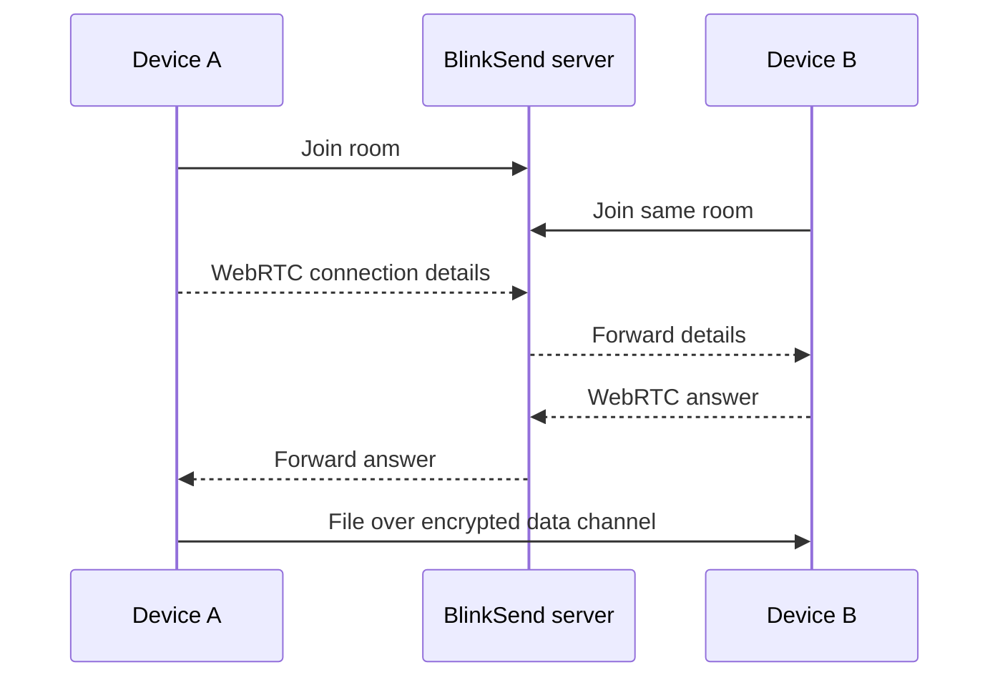

<p align="center"></p>
<h1 align="center">BlinkSend</h1>
<p align="center"><strong>Fast, private file sharing directly between browsers.</strong></p>
<p align="center">No account. No cloud file storage. Pair two devices, verify the peer, and send.</p>

<p align="center">
  <a href="https://github.com/ghostySRC/BlinkSend/actions/workflows/ci.yml"></a>
  <a href="https://github.com/ghostySRC/BlinkSend/actions/workflows/browser-e2e.yml"></a>
  
  
  <a href="LICENSE"></a>
</p>

<p align="center"><strong>0.4.0-beta.1</strong> · WebRTC · resumable transfers · SHA-256 verification · self-hostable</p>
<p align="center"><strong><a href="https://blinksend-production.up.railway.app">Try BlinkSend live</a></strong> · <a href="#see-it-in-action">Demo</a> · <a href="#why-blinksend">Why BlinkSend</a> · <a href="#quick-start">Quick start</a> · <a href="#deploy-your-own-instance">Self-host</a> · <a href="COMPATIBILITY.md">Compatibility</a></p>

> **Live demo:** https://blinksend-production.up.railway.app  
> **Beta:** BlinkSend is under active reliability and cross-browser testing. Chromium, Firefox, and WebKit pairing/verification/WebRTC clipboard flows run in CI; platform-specific file APIs still require real-device testing.

## Why BlinkSend

BlinkSend is an open-source, self-hosted **peer-to-peer file transfer** app for moving files, folders, links, and clipboard text between computers and phones. It uses **WebRTC data channels** for the transfer path, keeps normal file contents off the BlinkSend signaling server, requires an explicit peer-verification step, and verifies completed files with **SHA-256**.

- **Open the page and send:** no signup, account, or recipient app is required.
- **Direct when possible:** WebRTC connects the two browsers directly; TURN can relay encrypted traffic when direct connectivity fails.
- **Built for interrupted transfers:** numbered chunks, missing-range resume, and reload recovery on browsers with persistent file handles.
- **Self-hostable:** Node.js, Docker/Compose, health checks, reverse-proxy guidance, optional TURN, and Prometheus-style metrics.
- **Cross-browser tested:** automated Chromium, Firefox, and WebKit pairing + verification + WebRTC messaging checks.

## See it in action

<p align="center">
  
</p>

<p align="center">
  
  &nbsp;&nbsp;
  
</p>

### Pair in seconds

<p align="center">
  
</p>

The pairing demo is recorded from two real BlinkSend Chromium sessions using the actual signaling and verification flow. A permanently visible high-contrast cursor moves to each control, pauses on hover, visibly presses, and produces a click ripple before the real action occurs.

### Send, watch progress, verify

<p align="center">
  
</p>

The transfer demo is also captured from the running app: two real browser sessions pair, transfer a real local test file over BlinkSend's WebRTC path, display the live progress/speed/ETA UI, reach SHA-256 verified completion, and show the connected **Send another** flow. The test filename and measured speed are demonstration data, not benchmark claims.

### Queue and keep sending

<p align="center">
  
</p>

This real-browser walkthrough shows pending files being reordered and removed while a transfer is active, followed by the same verified peer session being reused through **Send another**.

The README media is reproducible: `scripts/capture-readme-media.mjs` launches the real BlinkSend server and Chromium. Static screenshots are captured at high DPI, walkthrough videos come from the running UI, a permanently visible cursor moves and pauses over every control before clicking, and motion is interpolated into **50 FPS** GIF output. The on-demand **Refresh README media** workflow regenerates and commits the assets after UI changes.

## Current flow

1. Open BlinkSend and choose **Send** or **Receive**.
2. Pair with an invite link, QR code, in-app QR scanner, or optional Nearby discovery.
3. Compare the same six-digit verification code on both devices and confirm it.
4. Send files, folders, clipboard text, pasted screenshots/files, or content received from the operating system share sheet.
5. BlinkSend shows Direct/Relay connection quality, smoothed speed, ETA, current-file progress, and whole-batch progress.
6. Every file is SHA-256 verified. Interrupted transfers request missing chunk ranges; supported browsers can resume after a page reload.

BlinkSend can also be installed as a PWA on supporting browsers. No account is required, and normal file contents are not stored by the BlinkSend signaling server.

## Features

- Simple Send / Receive entry flow for computer ↔ computer and phone ↔ computer sharing through an invite link, QR code, or an eight-character manual pairing code. Manual codes expire after 10 minutes, the sender UI shows the local expiration time, and the six-digit fingerprint check is still required.
- Installable PWA on supporting browsers, with an application-shell service worker for fast relaunch. Peer-to-peer transfers still require both devices to be online.
- In-app QR scanning on browsers that expose the Barcode Detection API and camera access; unsupported browsers can still use the system camera or paste the link.
- Optional Nearby discovery is off by default. A sender can advertise a device name and short-lived code for five minutes to receivers seen behind the same network address; peer verification is still mandatory.
- Send one file, several files, or choose an entire folder as a batch. On browsers with the File System Access API, BlinkSend recreates the folder tree automatically under one chosen destination. Dragging folders onto the drop area is also supported through modern File System handles, with a legacy directory-entry fallback where available.
- Direct encrypted browser-to-browser transfer when the network allows it; optional TURN relay support for harder networks.
- Peer verification code derived from the WebRTC DTLS fingerprints. Both devices must confirm the same six-digit code before sending is unlocked.
- Incremental SHA-256 verification for every file. A transfer is only reported as verified after sender and receiver hashes match.
- Transfer progress, average speed, cancellation, connection status, and clear errors when pairing fails.
- Pending individual files are shown in a visible queue and can be reordered, removed, or cleared while another file is sending. New individual files can be appended mid-transfer, and the picker resets after every enqueue so the same file can be added again if wanted; folders start only when the current file queue is idle. Accepted folder batches lock their membership so sender and receiver stay consistent.
- A verified sender session stays connected after completion and exposes **Send another**, so repeated transfers do not require pairing again.
- Reconnect/resume states are shown explicitly: connection loss, re-verification, resume percentage, and verification retry are no longer silent state changes.
- A hidden Diagnostics section in Settings shows connection state, Direct/Relay path, candidate types without addresses, RTT, measured throughput, chunk size, send-buffer target, reconnect count, and browser capability support.
- SHA-256 mismatches trigger up to two retries of only the affected file, so a bad file inside a large folder does not automatically discard the whole batch.
- Network-interface changes (for example Wi-Fi to hotspot) trigger an ICE restart from the offerer; active transfers remain paused until the connection is usable again.
- Restart-safe resume on supported browsers: persistent file handles and IndexedDB session metadata allow an interrupted transfer to continue after a page reload. Receiver writes are checkpointed to disk and a chunk bitmap/range map records what is present, so reconnects can request missing ranges rather than blindly restarting.
- Send clipboard text, commands, snippets, or `http://` / `https://` links directly to the paired device without creating a file first. Text is capped at 256 KB and framed into small UTF-8 control messages instead of relying on one oversized SCTP message.
- Paste-to-send: when the sender page is focused, pasting a clipboard file/image queues it; pasting text sends it directly.
- Automatic connection calibration after peer verification: BlinkSend measures a small 512 KiB WebRTC sample, combines it with RTT/device capability, and tunes the data-channel buffer automatically. Transfer chunks remain conservatively capped at 64 KiB for browser compatibility.
- Live transfer speed uses smoothing instead of a noisy instant value, includes an ETA, and folder batches show whole-batch bytes plus the current file.
- Connection status reports Direct vs Relay plus a simple Excellent / Good / Fair / Poor quality label based on measured RTT and throughput.
- English and Swedish interface, plus light and dark modes. Your choices are saved on each device; the initial theme follows your system setting.
- Your device nickname is stored locally and sent only to the connected peer. BlinkSend also keeps a small local list of recent peer names for recognition and includes the peer name in local transfer history. These labels are not cryptographic identities. Optional completion sound/vibration stays off unless enabled.
- Local-only transfer history keeps the latest verified file transfers and text sends in IndexedDB; it can be cleared from Settings.
- Received files can be handed to the operating system's native share sheet when the browser supports Web Share files.
- On platforms that support the Web Share Target API, BlinkSend can appear in the system Share menu. Shared files/text are intercepted locally by the service worker, staged in device-local IndexedDB, and then sent through the normal peer-to-peer flow after pairing.
- Large files stream to disk on browsers with the File System Access API. A bounded memory download is used elsewhere.
- Two participants per room, random 128-bit room links, no accounts, and no server-side file storage.

## Quick start

**Requirements:** Node.js 20 or later, npm, and a modern browser with WebRTC data channels.

```bash
git clone https://github.com/ghostySRC/BlinkSend.git
cd BlinkSend
npm ci
npm start
```

Open **http://localhost:3000** and choose **Send**. Open the generated invite link on the other device (or choose **Receive** and paste it), compare the verification code on both screens, then transfer files or a folder. Set `PORT=4000` to change the listening port.

To use a phone, deploy the app to an **HTTPS** address that both devices can reach. The phone cannot access your computer's `localhost`, and many browser features require a secure origin. Keep both pages open until each transfer finishes.

## How it works



The Node server serves the web interface and exchanges WebRTC connection details over `/signal`. File contents travel over the WebRTC data channel. When a TURN relay is configured and needed, the relay carries encrypted WebRTC traffic and consumes relay bandwidth. The server keeps room membership in memory, with a maximum of two sockets per room; inactive rooms expire after 30 minutes. Each live room also gets an eight-character code that maps to the random 128-bit room ID for 10 minutes. On SIGTERM/SIGINT, BlinkSend sends a restart notice, closes peers with WebSocket code 1012, and gives connections up to three seconds to drain before terminating WebSockets and any remaining HTTP connections.

For normal files, the recipient accepts the transfer before data starts. Folder transfers can be accepted once as a batch; on supported browsers the receiver chooses one destination and BlinkSend recreates nested directories automatically. Incoming relative paths are normalized and traversal segments such as `..` are rejected before any directory handle is opened. Files are split into numbered chunks. The receiver maintains a compact chunk bitmap and converts gaps into missing ranges during reconnect, allowing the sender to retransmit only those ranges. Network reconnects also attempt an ICE restart when the browser reports a network-interface change. When both sides use persistent File System Access handles, BlinkSend also stores the active session in IndexedDB so a page reload can resume the current transfer after the user grants access again. Browsers without persistent handles keep the in-page resume behavior only. Offline delivery is not supported, and only one file is active at a time.

## Browser and file limits

| Receiving browser capability | Save behavior | File limit in BlinkSend |
| --- | --- | --- |
| Supports `showSaveFilePicker` | Writes chunks to the chosen file as they arrive | Up to the current 256 GiB safety cap; disk space and browser limits still apply |
| No save picker, but supports Origin Private File System (OPFS) | Streams large files into temporary browser-managed disk storage, then starts the download | Up to the current 256 GiB safety cap; available storage/quota and browser limits still apply |
| No save picker and no OPFS | Buffers the file in memory, then starts a download | 200 MB per file |

The 200 MB memory fallback applies only when the browser exposes neither a save-file picker nor OPFS. Independent anti-resource-exhaustion limits currently cap a single announced file at 256 GiB and an accepted batch at 10,000 files / 512 GiB. Transfer speed depends on the sender's upload connection, the receiver's download connection, Wi-Fi quality, browser performance, and whether a relay is required. BlinkSend performs a short post-verification calibration before enabling new sends, preventing calibration frames from overlapping real file data, and tunes its WebRTC send-buffer target while keeping file messages at or below 64 KiB for compatibility. It does not promise a fixed speed.

## Deploy your own instance

BlinkSend now includes a production-oriented `Dockerfile`, `compose.yaml`, and `deploy/Caddyfile.example`. The container runs as the unprivileged Node user, drops Linux capabilities in Compose, uses a read-only root filesystem, and exposes a health check.

### Docker / Compose

```bash
docker compose up -d --build
```

By default Compose binds BlinkSend to `127.0.0.1:3000` so a host reverse proxy can terminate HTTPS. Copy `deploy/Caddyfile.example`, replace the hostname, and set `TRUST_PROXY=1` only when that proxy is the only route to the Node process.

### Direct Node deployment

Run one long-lived Node process behind an HTTPS reverse proxy. The proxy must forward WebSocket upgrades at `/signal`. A static host such as GitHub Pages cannot run the signaling server by itself.

1. Point a domain name to your server and install Node.js 20 or later.
2. Run `npm ci --omit=dev`, then start `npm start` with a process manager.
3. Proxy HTTPS traffic to BlinkSend's listening port. For example, a Caddyfile can contain:

   ```caddyfile
   blinksend.example.com {
       reverse_proxy 127.0.0.1:3000
   }
   ```

4. Open `https://blinksend.example.com/health` to check the process, then test the site from two devices. The health endpoint returns `{"status":"ok"}`.

If the reverse proxy is the only process allowed to connect to BlinkSend, set `TRUST_PROXY=1` and configure the proxy to **overwrite** `X-Forwarded-For`; BlinkSend accepts the forwarded value only when it parses as an IP address. Otherwise leave proxy trust disabled. With `METRICS_TOKEN` set, `/metrics` exposes token-protected, per-IP-rate-limited Prometheus-style counters/gauges for rooms, peers, signaling, pair-code lookups, rate limits, and ICE issuance without room IDs or client IP labels.

Use one server process for now: room membership, manual pairing codes, Nearby records, and rate-limit buckets are held in that process's memory. Running multiple replicas behind a load balancer without shared room/signaling state will break pairing. The included container/Compose setup intentionally runs one application replica.

### Optional TURN relay

Direct WebRTC connections can fail behind restrictive NATs or firewalls. A TURN server can relay those transfers. BlinkSend supports a TURN server configured with a shared authentication secret, such as coturn's `use-auth-secret` mode.

| Variable | Purpose | Default |
| --- | --- | --- |
| `PORT` | HTTP and WebSocket listening port | `3000` |
| `TURN_URLS` | Comma-separated `turn:` or `turns:` URLs advertised to browsers | Empty |
| `TURN_SECRET` | Shared TURN authentication secret used to issue temporary credentials | Empty |
| `TRUST_PROXY` | Trust the first `X-Forwarded-For` address for rate limits/Nearby. Enable only behind a proxy that overwrites this header. | `false` |
| `METRICS_TOKEN` | Enables `/metrics` and requires `Authorization: Bearer <token>` | Empty / metrics disabled |
| `LOG_FORMAT` | `text` or `json` startup/shutdown logs without room IDs, codes, or IPs | `text` |
| `LOG_LEVEL` | Set to `silent` to disable server logs | `info` |

Set both TURN variables on the BlinkSend server. Configure the same shared secret on your TURN server; **never commit it to the repository**. BlinkSend returns credentials valid for one hour from `/ice`. A TURN relay carries file traffic and can create bandwidth costs. Without the two TURN variables, BlinkSend uses a public STUN server and direct connections only.

## Privacy and security

- The room identifier is random and is included in the invite link. Anyone with the link can attempt to join that room, so share it privately and create a new room when needed.
- After WebRTC connects, BlinkSend displays a six-digit verification code derived from both DTLS certificate fingerprints. Transfer controls remain locked until the user confirms that both screens show the same code. Nearby discovery does not bypass this verification step.
- File contents are verified end-to-end with SHA-256 before BlinkSend reports a verified transfer.
- WebRTC encrypts the data channel in transit. The BlinkSend server forwards connection details, but its normal transfer path does not receive file contents.
- The receiving browser sees a filename and size before accepting. The signaling server does not need the file bytes or filename to pair devices.
- A TURN server, if enabled, carries encrypted traffic and can observe connection metadata and traffic volume.
- Files are not uploaded for later retrieval. Both participants must be online at the same time. Transfer history, local device name, preferences, persistent resume metadata, and any pending PWA share-target payload remain in browser-local storage and are not synced to the BlinkSend server.

BlinkSend includes in-memory per-IP limits for room joins, WebSocket upgrades, QR generation, and ICE credential requests; malformed signaling is rejected and abusive sockets are closed. TURN credentials require a short-lived token issued through a successful room join. These controls are intentionally lightweight and single-process: a serious public deployment should also add reverse-proxy/CDN rate limiting, centralized abuse monitoring, TURN bandwidth quotas, and shared state before horizontal scaling.

## Troubleshooting

| Symptom | What to check |
| --- | --- |
| Phone cannot open the invite | Use a public HTTPS URL; `localhost` on your computer refers only to that computer. |
| Room says “Room full” | Two connections are already present. Close an old tab or create a new room. |
| Devices stay at “Connecting” | Refresh both pages. Try the same Wi-Fi; for restrictive networks, configure TURN. |
| Incoming file cannot be accepted | The browser supports neither direct disk streaming nor OPFS and the file is over the 200 MB memory fallback limit. Try a newer browser. |
| A transfer stops midway | BlinkSend should resume after reconnect. On supported desktop browsers it can also recover the current transfer after a reload; click **Resume transfer** and grant file access if prompted. |
| Reverse proxy loads the page but pairing fails | Ensure `/signal` supports WebSocket upgrades and the page is served over HTTPS. |

## Client architecture

Security- and recovery-sensitive primitives are separated from the UI controller: `verification.js` derives the peer code from DTLS fingerprints, `connection.js` summarizes selected WebRTC transport statistics without exposing candidate addresses, `transfer-core.js` owns chunk/bitmap/hash primitives, `storage.js` owns bounded filesystem traversal, `security.js` owns peer-input limits, `control-policy.js` blocks impossible/pre-verification control flows, and `persistence.js` owns IndexedDB session/history state. `app.js` remains the browser orchestrator rather than the implementation home for every primitive.

## Reliability and resource limits

BlinkSend treats the other browser as untrusted. Before allocating transfer state or creating destination structures, the client applies explicit limits to control-message size, file metadata, batch counts and bytes, path depth/length, text framing, resume ranges, queue length, and total chunk count. These limits are defined in `public/security.js` and covered by hostile-input tests. File/folder/text/benchmark initiation is also rejected until mutual peer verification completes; persisted reload-resume metadata is revalidated before restore, sender resume refuses a source file that changed size or modification time, accepted folder batches enforce the originally declared file count/byte total through completion, resume positions are bounded to the actual file chunk count, and missing-range resumes use the same precomputed full-file hash for final receiver acknowledgement; they are safety bounds rather than advertised performance targets.

## v0.4 reliability focus

This beta intentionally freezes feature expansion while transfer/recovery/security behavior is hardened. The current pass modularizes security-sensitive primitives, validates hostile peer input before allocation, enforces the peer-verification boundary, tests multi-disconnect reload recovery, validates persisted resume state, enforces accepted folder manifests, fixes missing-range resume hash acknowledgement, and adds real Chromium/Firefox/WebKit pairing + WebRTC clipboard E2E.

See [`CHANGELOG.md`](CHANGELOG.md) for release notes.

## Browser compatibility

Automated pairing/verification/WebRTC clipboard E2E runs against Chromium, Firefox, and WebKit on every pull request. Platform-specific file/storage APIs still require real-device validation; see [`COMPATIBILITY.md`](COMPATIBILITY.md) for the capability and manual-test matrix.

## Development

Project/runtime documentation is kept in `README.md` and `SECURITY.md` so the repository stays focused on BlinkSend itself.

```bash
npm ci
npm test
npm run bench
npm run loadtest
# Browser E2E is executed by .github/workflows/browser-e2e.yml
npm start
```

`npm test` explicitly runs only `test/*.test.js` (so benchmark/load scripts can never be auto-discovered as tests) and covers signaling abuse controls, manual pairing and metrics, explicit trusted-proxy IP parsing, graceful restart notification/close behavior, SHA-256 vectors, browser-script syntax, PWA manifest invariants, UTF-8 text framing, path traversal rejection, corruption detection, a 10,000-file manifest, and a sparse chunk bitmap sized for a 5 GiB transfer without allocating 5 GiB of data. `npm run bench` prints repeatable timings for the 5 GiB-equivalent chunk map and 10,000-file manifest operations. `npm run loadtest` runs `scripts/load-benchmark.mjs`, boots the real signaling server, creates 10 simultaneous rooms / 20 WebSockets, forwards 500 validated signaling messages, resolves manual pairing codes, checks health, and shuts the server down.

`public/` contains the browser interface and transfer logic. `server.js` serves static files, QR codes, manual pairing resolution, optional Nearby/metrics endpoints, temporary ICE credentials, WebSocket signaling, and graceful shutdown handling. `test/` covers the server's room behavior. The project uses no frontend build step.

Contributions and real-device test reports are welcome. Start with [`CONTRIBUTING.md`](CONTRIBUTING.md) or use the repository issue forms for bugs and browser/network compatibility reports. Do not post private invite links, TURN credentials, or other secrets.

If BlinkSend is useful to you, starring the repository helps other people discover it.

## License

[MIT](LICENSE) © 2026 ghosty.
