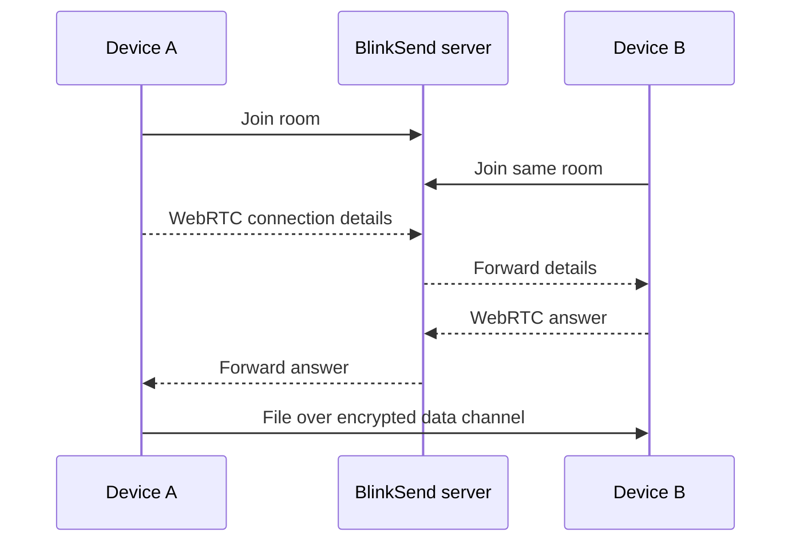

<p align="center"></p>
<h1 align="center">BlinkSend</h1>
<p align="center">A self-hosted file transfer tool for two browsers.</p>
<p align="center"><a href="#quick-start">Quick start</a> · <a href="#see-it-in-action">See it in action</a> · <a href="#deploy-your-own-instance">Self-host</a> · <a href="#how-it-works">How it works</a></p>

<p align="center"></p>
<p align="center"><sub>Desktop · English · Light mode</sub></p>

> **Early release:** transfers across real devices and networks still need field testing. There is no public hosted instance yet. The GIFs below are staged captures of the current interface; they show the transfer states, not a verified transfer between devices.

## See it in action

### Pair two devices

<p align="center"></p>

Open the room link on a second device or scan the QR code. The connection indicator changes when both browsers join.

### Receive files

<p align="center"></p>

Select multiple files on the sender, accept each one on the receiver, and follow progress and speed in the browser.

### Language and appearance

<table align="center"><tr><th>English · Light mode</th><th>Svenska · Mörkt läge</th></tr><tr><td></td><td></td></tr></table>

Use the language selector and theme button in the header. BlinkSend remembers both choices on each device; before you choose a theme, it follows your system preference. The same interface adapts to smaller screens. A public HTTPS deployment is required to connect a phone to a computer outside this local preview.

## Features

- Simple Send / Receive entry flow for computer ↔ computer and phone ↔ computer sharing through an invite link or QR code.
- Send one file, several files, or choose an entire folder as a batch. On browsers with the File System Access API, BlinkSend recreates the folder tree automatically under one chosen destination.
- Direct encrypted browser-to-browser transfer when the network allows it; optional TURN relay support for harder networks.
- Peer verification code derived from the WebRTC DTLS fingerprints. Both devices must confirm the same six-digit code before sending is unlocked.
- Incremental SHA-256 verification for every file. A transfer is only reported as verified after sender and receiver hashes match.
- Transfer progress, average speed, cancellation, connection status, and clear errors when pairing fails.
- Restart-safe resume on supported browsers: persistent file handles and IndexedDB session metadata allow an interrupted transfer to continue after a page reload. Receiver writes are checkpointed to disk so only the last uncommitted window may need to be resent.
- Send clipboard text, commands, snippets, or `http://` / `https://` links directly to the paired device without creating a file first. Text is capped at 256 KB.
- Paste-to-send: when the sender page is focused, pasting a clipboard file/image queues it; pasting text sends it directly.
- Higher-throughput WebRTC sending with 64 KiB chunks and a larger buffered send window for fast local networks.
- English and Swedish interface, plus light and dark modes. Your choices are saved on each device; the initial theme follows your system setting.
- Optional local device names are exchanged only with the connected peer. Optional completion sound/vibration stays off unless enabled.
- Local-only transfer history keeps the latest verified file transfers and text sends in IndexedDB; it can be cleared from Settings.
- Received files can be handed to the operating system's native share sheet when the browser supports Web Share files.
- Large files stream to disk on browsers with the File System Access API. A bounded memory download is used elsewhere.
- Two participants per room, random 128-bit room links, no accounts, and no server-side file storage.

## Quick start

**Requirements:** Node.js 20 or later, npm, and a modern browser with WebRTC data channels.

```bash
git clone https://github.com/ghostySRC/BlinkSend.git
cd BlinkSend
npm ci
npm start
```

Open **http://localhost:3000** and choose **Send**. Open the generated invite link on the other device (or choose **Receive** and paste it), compare the verification code on both screens, then transfer files or a folder. Set `PORT=4000` to change the listening port.

To use a phone, deploy the app to an **HTTPS** address that both devices can reach. The phone cannot access your computer's `localhost`, and many browser features require a secure origin. Keep both pages open until each transfer finishes.

## How it works



The Node server serves the web interface and exchanges WebRTC connection details over `/signal`. File contents travel over the WebRTC data channel. When a TURN relay is configured and needed, the relay carries encrypted WebRTC traffic and consumes relay bandwidth. The server keeps room membership in memory, with a maximum of two sockets per room; inactive rooms expire after 30 minutes. A server restart disconnects active rooms.

For normal files, the recipient accepts the transfer before data starts. Folder transfers can be accepted once as a batch; on supported browsers the receiver chooses one destination and BlinkSend recreates nested directories automatically. Files are split into numbered chunks. Network reconnects resume from the receiver's next missing chunk. When both sides use persistent File System Access handles, BlinkSend also stores the active session in IndexedDB so a page reload can resume the current transfer after the user grants access again. Browsers without persistent handles keep the in-page resume behavior only. Offline delivery is not supported, and only one file is active at a time.

## Browser and file limits

| Receiving browser capability | Save behavior | File limit in BlinkSend |
| --- | --- | --- |
| Supports `showSaveFilePicker` | Writes chunks to the chosen file as they arrive | No app-imposed size limit; disk space and browser limits still apply |
| No save picker, but supports Origin Private File System (OPFS) | Streams large files into temporary browser-managed disk storage, then starts the download | No app-imposed size limit; available storage/quota and browser limits still apply |
| No save picker and no OPFS | Buffers the file in memory, then starts a download | 200 MB per file |

The 200 MB memory fallback now applies only when the browser exposes neither a save-file picker nor OPFS. Transfer speed depends on the sender's upload connection, the receiver's download connection, Wi-Fi quality, browser performance, and whether a relay is required. BlinkSend uses 64 KiB chunks and allows a larger amount of queued WebRTC data to better utilize fast connections, but it does not promise a fixed speed.

## Deploy your own instance

Run one long-lived Node process behind an HTTPS reverse proxy. The proxy must forward WebSocket upgrades at `/signal`. A static host such as GitHub Pages cannot run the signaling server by itself.

1. Point a domain name to your server and install Node.js 20 or later.
2. Run `npm ci --omit=dev`, then start `npm start` with a process manager.
3. Proxy HTTPS traffic to BlinkSend's listening port. For example, a Caddyfile can contain:

   ```caddyfile
   blinksend.example.com {
       reverse_proxy 127.0.0.1:3000
   }
   ```

4. Open `https://blinksend.example.com/health` to check the process, then test the site from two devices. The health endpoint returns `{"status":"ok"}`.

Use one server process for now: room membership is held in that process's memory. Running multiple replicas behind a load balancer without shared room state will break pairing.

### Optional TURN relay

Direct WebRTC connections can fail behind restrictive NATs or firewalls. A TURN server can relay those transfers. BlinkSend supports a TURN server configured with a shared authentication secret, such as coturn's `use-auth-secret` mode.

| Variable | Purpose | Default |
| --- | --- | --- |
| `PORT` | HTTP and WebSocket listening port | `3000` |
| `TURN_URLS` | Comma-separated `turn:` or `turns:` URLs advertised to browsers | Empty |
| `TURN_SECRET` | Shared TURN authentication secret used to issue temporary credentials | Empty |

Set both TURN variables on the BlinkSend server. Configure the same shared secret on your TURN server; **never commit it to the repository**. BlinkSend returns credentials valid for one hour from `/ice`. A TURN relay carries file traffic and can create bandwidth costs. Without the two TURN variables, BlinkSend uses a public STUN server and direct connections only.

## Privacy and security

- The room identifier is random and is included in the invite link. Anyone with the link can attempt to join that room, so share it privately and create a new room when needed.
- After WebRTC connects, BlinkSend displays a six-digit verification code derived from both DTLS certificate fingerprints. Transfer controls remain locked until the user confirms that both screens show the same code.
- File contents are verified end-to-end with SHA-256 before BlinkSend reports a verified transfer.
- WebRTC encrypts the data channel in transit. The BlinkSend server forwards connection details, but its normal transfer path does not receive file contents.
- The receiving browser sees a filename and size before accepting. The signaling server does not need the file bytes or filename to pair devices.
- A TURN server, if enabled, carries encrypted traffic and can observe connection metadata and traffic volume.
- Files are not uploaded for later retrieval. Both participants must be online at the same time. Transfer history, local device name, preferences, and persistent resume metadata remain in the user's browser storage and are not synced to the BlinkSend server.

BlinkSend includes in-memory per-IP limits for room joins, WebSocket upgrades, QR generation, and ICE credential requests; malformed signaling is rejected and abusive sockets are closed. TURN credentials require a short-lived token issued through a successful room join. These controls are intentionally lightweight and single-process: a serious public deployment should also add reverse-proxy/CDN rate limiting, centralized abuse monitoring, TURN bandwidth quotas, and shared state before horizontal scaling.

## Troubleshooting

| Symptom | What to check |
| --- | --- |
| Phone cannot open the invite | Use a public HTTPS URL; `localhost` on your computer refers only to that computer. |
| Room says “Room full” | Two connections are already present. Close an old tab or create a new room. |
| Devices stay at “Connecting” | Refresh both pages. Try the same Wi-Fi; for restrictive networks, configure TURN. |
| Incoming file cannot be accepted | The browser supports neither direct disk streaming nor OPFS and the file is over the 200 MB memory fallback limit. Try a newer browser. |
| A transfer stops midway | BlinkSend should resume after reconnect. On supported desktop browsers it can also recover the current transfer after a reload; click **Resume transfer** and grant file access if prompted. |
| Reverse proxy loads the page but pairing fails | Ensure `/signal` supports WebSocket upgrades and the page is served over HTTPS. |

## Development and contributions

```bash
npm ci
npm test
npm start
```

`public/` contains the browser interface and transfer logic. `server.js` serves static files, QR codes, temporary ICE credentials, and WebSocket signaling. `test/` covers the server's room behavior. The project uses no frontend build step.

Contributions are welcome. For a bug report, include browser and operating system versions, whether the devices were on the same network, the connection status shown in BlinkSend, and steps to reproduce the problem. Do not post private invite links or TURN credentials.

## License

[MIT](LICENSE) © 2026 ghosty.
