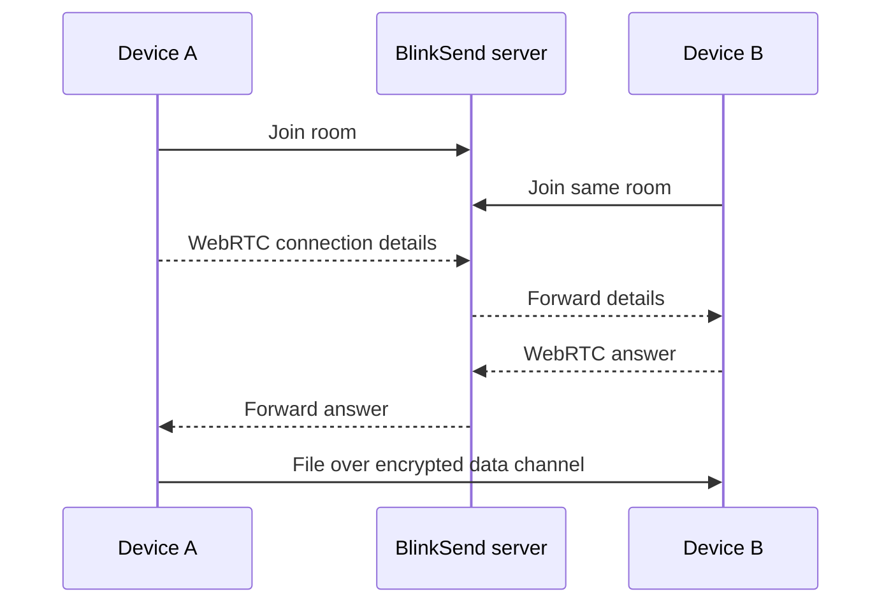

# BlinkSend

**Send files between computers and phones from a browser.** Open the same room on two devices, accept the incoming file, and transfer it over a WebRTC data channel. No account or app installation is required.

> **Project status:** early release. The room server and browser transfer flow have automated checks, but transfers across real devices and different networks still need field testing. There is no hosted public instance yet.

## Features

- Computer ↔ computer and phone ↔ computer sharing through an invite link or QR code.
- Send one file or select several files as a batch. The receiver accepts or declines each file.
- Direct encrypted browser-to-browser transfer when the network allows it; optional TURN relay support for harder networks.
- Transfer progress, average speed, cancellation, connection status, and clear errors when pairing fails.
- Large files stream to disk on browsers with the File System Access API. A bounded memory download is used elsewhere.
- Two participants per room, random 128-bit room links, no accounts, and no server-side file storage.

## Quick start

**Requirements:** Node.js 20 or later, npm, and a modern browser with WebRTC data channels.

```bash
git clone https://github.com/ghostySRC/BlinkSend.git
cd BlinkSend
npm ci
npm start
```

Open **http://localhost:3000** in two browser tabs. Copy the invite link from the first tab into the second, choose one or more files, and accept them on the receiving side. Set `PORT=4000` to change the listening port.

To use a phone, deploy the app to an **HTTPS** address that both devices can reach. The phone cannot access your computer's `localhost`, and many browser features require a secure origin. Keep both pages open until each transfer finishes.

## How it works



The Node server serves the web interface and exchanges WebRTC connection details over `/signal`. File contents travel over the WebRTC data channel. When a TURN relay is configured and needed, the relay carries encrypted WebRTC traffic and consumes relay bandwidth. The server keeps room membership in memory, with a maximum of two sockets per room; inactive rooms expire after 30 minutes. A server restart disconnects active rooms.

The recipient must accept each file. Batches are sent sequentially; declining one file moves to the next. This version has no transfer resume or offline delivery. Only one file is active at a time.

## Browser and file limits

| Receiving browser capability | Save behavior | File limit in BlinkSend |
| --- | --- | --- |
| Supports `showSaveFilePicker` | Writes chunks to the chosen file as they arrive | No app-imposed size limit; disk space and browser limits still apply |
| Does not support `showSaveFilePicker` | Buffers the file in memory, then starts a download | 200 MB per file |

This fallback is especially relevant to phones and browsers that lack the File System Access API. Transfer speed depends on the sender's upload connection, the receiver's download connection, Wi-Fi quality, browser performance, and whether a relay is required. BlinkSend does not promise a fixed speed.

## Deploy your own instance

Run one long-lived Node process behind an HTTPS reverse proxy. The proxy must forward WebSocket upgrades at `/signal`. A static host such as GitHub Pages cannot run the signaling server by itself.

1. Point a domain name to your server and install Node.js 20 or later.
2. Run `npm ci --omit=dev`, then start `npm start` with a process manager.
3. Proxy HTTPS traffic to BlinkSend's listening port. For example, a Caddyfile can contain:

   ```caddyfile
   blinksend.example.com {
       reverse_proxy 127.0.0.1:3000
   }
   ```

4. Open `https://blinksend.example.com/health` to check the process, then test the site from two devices. The health endpoint returns `{"status":"ok"}`.

Use one server process for now: room membership is held in that process's memory. Running multiple replicas behind a load balancer without shared room state will break pairing.

### Optional TURN relay

Direct WebRTC connections can fail behind restrictive NATs or firewalls. A TURN server can relay those transfers. BlinkSend supports a TURN server configured with a shared authentication secret, such as coturn's `use-auth-secret` mode.

| Variable | Purpose | Default |
| --- | --- | --- |
| `PORT` | HTTP and WebSocket listening port | `3000` |
| `TURN_URLS` | Comma-separated `turn:` or `turns:` URLs advertised to browsers | Empty |
| `TURN_SECRET` | Shared TURN authentication secret used to issue temporary credentials | Empty |

Set both TURN variables on the BlinkSend server. Configure the same shared secret on your TURN server; **never commit it to the repository**. BlinkSend returns credentials valid for one hour from `/ice`. A TURN relay carries file traffic and can create bandwidth costs. Without the two TURN variables, BlinkSend uses a public STUN server and direct connections only.

## Privacy and security

- The room identifier is random and is included in the invite link. Anyone with the link can join that room, so share it privately and create a new room when needed.
- WebRTC encrypts the data channel in transit. The BlinkSend server forwards connection details, but its normal transfer path does not receive file contents.
- The receiving browser sees a filename and size before accepting. The signaling server does not need the file bytes or filename to pair devices.
- A TURN server, if enabled, carries encrypted traffic and can observe connection metadata and traffic volume.
- Files are not uploaded for later retrieval. Both participants must be online at the same time.

BlinkSend is currently designed for trusted, small-scale deployment. A public instance should add operational controls such as traffic limits, TURN usage monitoring, and abuse protection before wide promotion.

## Troubleshooting

| Symptom | What to check |
| --- | --- |
| Phone cannot open the invite | Use a public HTTPS URL; `localhost` on your computer refers only to that computer. |
| Room says “Room full” | Two connections are already present. Close an old tab or create a new room. |
| Devices stay at “Connecting” | Refresh both pages. Try the same Wi-Fi; for restrictive networks, configure TURN. |
| Incoming file cannot be accepted | The browser's memory download limit is 200 MB. Receive it in a browser that supports disk streaming. |
| A transfer stops midway | Keep both tabs open and networks stable. The current version cannot resume a partial file. |
| Reverse proxy loads the page but pairing fails | Ensure `/signal` supports WebSocket upgrades and the page is served over HTTPS. |

## Development and contributions

```bash
npm ci
npm test
npm start
```

`public/` contains the browser interface and transfer logic. `server.js` serves static files, QR codes, temporary ICE credentials, and WebSocket signaling. `test/` covers the server's room behavior. The project uses no frontend build step.

Contributions are welcome. For a bug report, include browser and operating system versions, whether the devices were on the same network, the connection status shown in BlinkSend, and steps to reproduce the problem. Do not post private invite links or TURN credentials.

## License

[MIT](LICENSE) © 2026 ghosty.
